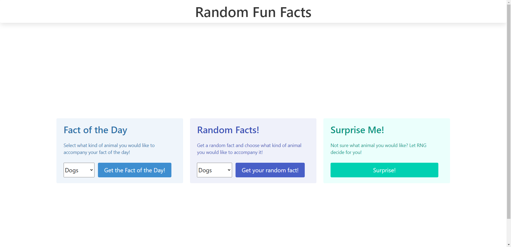
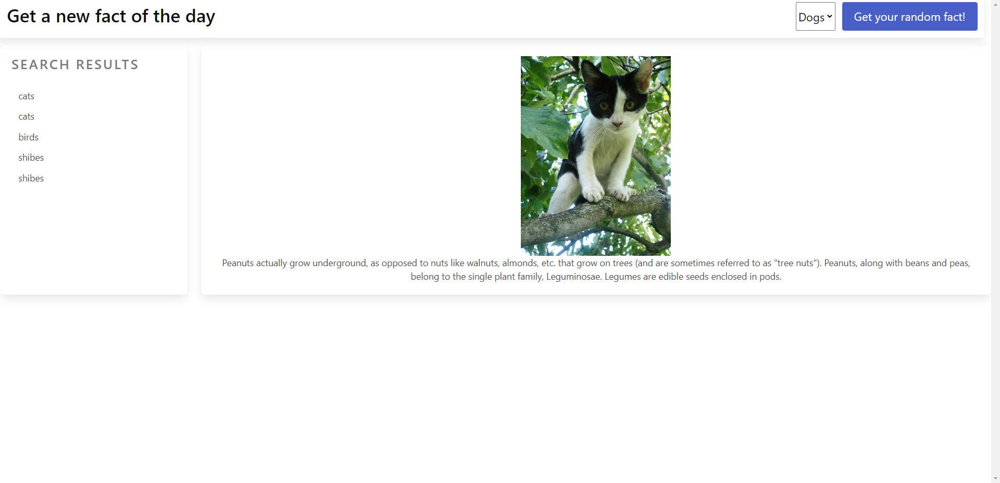

# Random-fun-facts

## Description
This web appp generates a random fact or fact of the day. An image of either a cat, dog, or bird is also generated to accompany the fact based on which animal the user selects. Alternatively, there is also a Surprise Me button that will randomly select which animal to generate. This app uses the useless facts api and the shibe.online api to generate the facts and images: https://uselessfacts.jsph.pl/ ;  https://shibe.online/

## Installation
N/A

## Usage
Use this app as a fun way to learn some new, random facts. The animals help keep it interesting as you fill up your brain with facts to impress your friends. 

## License
N/A

## Live Link
https://snl23.github.io/Random-fun-facts/

## Screenshot

##
